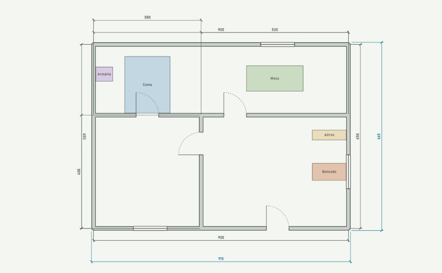
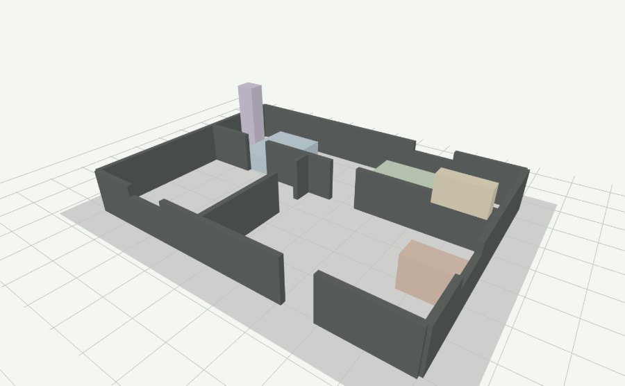

**Português** · [English](README.en.md)

# Prancheta CAD

Editor de **planta baixa** que roda no navegador, em escala real, com cotas
automáticas, linha de comando no estilo AutoCAD e vista 3D das paredes.

Um único arquivo HTML. Sem servidor, sem build, sem dependências, sem instalação.

**▶ [Abrir o editor](https://rt3norio.github.io/prancheta-cad/)** — carrega com uma
planta de exemplo pronta para você mexer.



A mesma planta na vista 3D, com as paredes cortadas a 120 cm para enxergar o
interior. O armário de 220 cm ultrapassa o corte e o armário aéreo aparece na sua
altura de instalação:



---

## Por que existe

Ferramentas de planta baixa na web costumam cair em dois extremos: ou são
"desenhadores de casinha" que não têm escala nem cotas, ou são CAD completos que
exigem conta, plugin ou instalação.

A Prancheta fica no meio: desenha em **milímetros de verdade**, gera **cotas**, e
aceita a mesma entrada de coordenadas que quem usa AutoCAD já tem no dedo —
`@300,0`, `@400<90`, distância direta com ortogonal travado. Mas abre com dois
cliques e cabe num arquivo.

Serve para quem precisa levantar um ambiente rápido, estudar um leiaute de móveis
ou passar uma medida adiante sem abrir o CAD de verdade.

---

## Começando

**Na web:** [rt3norio.github.io/prancheta-cad](https://rt3norio.github.io/prancheta-cad/)

**Local:** baixe `prancheta.html` e abra com duplo clique. Funciona offline, e é
nessa versão que gravar arquivo no disco funciona sem restrição.

O desenho é salvo sozinho no navegador (`localStorage`) a cada alteração, então
fechar a aba não perde o trabalho.

---

## O que dá para fazer

- **Paredes** em cadeia, com espessura e pé-direito, junção automática nos cantos
- **Portas e janelas** inseridas na parede clicada, com largura, altura e peitoril,
  e a abertura da porta invertível nos dois eixos — dobradiça à esquerda ou à
  direita, folha varrendo para dentro ou para fora
- **Móveis** como caixas com nome, altura, base e cor pastel — mesa, cama, armário,
  bancada, armário aéreo
- **Cotas** automáticas em cada parede e no contorno geral, mais cotas manuais
- **Vista 3D** com as paredes extrudadas e os vãos realmente vazados
- **Exportar** o desenho em `.json` e o vetor em `.svg` na escala 1:1

---

## Ferramentas

Barra à esquerda, todas também acessíveis por comando digitado. O painel abaixo da
barra muda conforme a ferramenta ativa ou o objeto selecionado, e cada campo tem
explicação ao passar o mouse.

| Ferramenta | Comando | Como usar |
|---|---|---|
| Selecionar | `Esc` | Clique num objeto para editar suas medidas no painel |
| Parede | `L` | Clique ponto a ponto; `Enter` ou botão direito encerra a cadeia |
| Porta | `POR` | Clique sobre uma parede |
| Janela | `JAN` | Clique sobre uma parede |
| Móvel | `CX` | Clique dois cantos opostos |
| Cota | `DIM` | Dois pontos a medir, depois um terceiro posiciona a linha |
| Medir | `DI` | Informa distância, Δx, Δy e ângulo, sem criar nada |
| Pan | `P` | Arrasta a vista até você apertar `Esc` |
| Zoom | `Z` | Enquadra o desenho inteiro |
| Mover | `M` | Objeto, ponto base, destino |
| Copiar | `CO` | Igual ao mover, mantendo o original |
| Apagar | `E` | Remove o que estiver selecionado |

Clicar num objeto já desenhado abre suas propriedades: um vão traz largura, altura,
peitoril e posição — e, sendo porta, dois botões que invertem a **dobradiça** (a mão
da porta) e o **sentido** (para que lado a folha varre); um móvel traz nome,
dimensões, base, rotação e cor; uma parede traz espessura, pé-direito e o
comprimento medido; uma cota traz o afastamento.

---

## Linha de comando

A barra inferior aceita comandos como no AutoCAD. `Enter` com a linha vazia repete
o último comando; `Esc` cancela; a barra de espaço funciona como `Enter` quando o
que você digitou é um comando.

### Coordenadas

Os quatro formatos, sempre na unidade de trabalho corrente:

| Digite | Significa |
|---|---|
| `300,150` | Coordenada absoluta X,Y |
| `@300,0` | Relativa ao último ponto |
| `@400<90` | Polar relativa: distância `<` ângulo em graus |
| `300` | Distância direta na direção do cursor (com Orto ligado) |

### Ajustes

| Comando | O que faz |
|---|---|
| `ESP 15` | Espessura da parede |
| `ALT 280` | Pé-direito |
| `PALT 210` · `JALT 120` · `PEIT 90` | Altura de porta, de janela e peitoril |
| `INV` · `INVS` | Inverte a dobradiça e o sentido de abertura da porta |
| `COR 1..8` | Cor do móvel |
| `GRADE 10` | Passo da grade |
| `UN mm\|cm\|m` | Unidade de trabalho |
| `Z` | Zoom estendido |
| `3D` | Alterna a vista tridimensional |
| `CORTE 120` | Altura de corte das paredes no 3D; sem argumento, liga e desliga |
| `AJUDA` | Lista completa dentro do próprio editor |

### Atalhos

`F8` ortogonal · `F9` grade · `F3` osnap · `F11` rastreio · `F2` console ·
`Delete` apagar · `Ctrl+Z` / `Ctrl+Y` desfazer e refazer · setas deslocam a vista,
com `Shift` mais rápido · `Alt+arrastar` ou botão do meio também deslocam, a
qualquer momento · roda do mouse para zoom no cursor.

## Console

A barra de comandos fica **escondida por padrão** — o desenho ocupa a tela inteira.
Digitar qualquer letra abre o console automaticamente, e `F2` ou o botão `Console`
alternam à mão. Com ele fechado nada se perde: os atalhos continuam valendo e as
mensagens aparecem numa faixa sobre o desenho, em vermelho quando são erro. A
preferência fica guardada entre sessões.

---

## Snap

Com **OSnap** ligado, o cursor gruda nas **faces** das paredes, nos cantos onde duas
faces se encontram e nas arestas dos móveis. É isso que faz um móvel encostar na
parede sem entrar nela.

O detalhe que importa: uma parede é guardada pelo seu **eixo**, que passa no meio da
espessura. Grudar no eixo enfiaria o móvel metade da parede adentro. Por isso
qualquer ponto de snap que caia no miolo da alvenaria é descartado — e ao desenhar
paredes a prioridade se inverte de volta para o eixo, que é por onde a parede é
traçada.

Marcadores no cursor: quadrado para extremidade e canto, X para interseção,
ampulheta para face, triângulo para meio.

### Rastreio (F11)

Mire um canto, espere um instante — aparece um `+` amarelo, o ponto foi
**adquirido** — e afaste o cursor. Saem dele guias horizontais e verticais, e o
cursor trava nelas.

É o que o Orto sozinho não faz: o Orto alinha com o **ponto de onde você está
desenhando**, o rastreio alinha com **qualquer canto que você mirou antes**. Adquira
dois pontos e o cruzamento das guias vira um ponto de encaixe — assim se pega, por
exemplo, o alinhamento vertical de uma parede com a altura horizontal de outra.

Mirar o mesmo ponto de novo o solta; `Esc` limpa todos; dois pontos ficam
adquiridos por vez. O osnap tem prioridade sobre as guias.

---

## Cotas

As **automáticas** são geradas a cada quadro: uma por parede, deslocada para o lado
de fora, mais duas do contorno geral. Não são objetos — clicar nelas seleciona a
parede que medem. Ligue e desligue no botão `Cotas`.

As **manuais** (`DIM`) são objetos de verdade: selecionáveis, com afastamento
editável, e podem ser movidas, copiadas e apagadas.

Ticks arquitetônicos a 45°, texto sempre legível independentemente do ângulo, e a
medida na unidade de trabalho corrente.

---

## Vista 3D

As paredes são extrudadas até o pé-direito e os vãos são realmente **vazados**: cada
parede é decomposta numa grade posição × altura, as células que caem dentro de um
vão são descartadas e só as faces de fronteira viram geometria — não há superfície
interna sobrando.

Os móveis viram caixas com a sua cor, respeitando a base, o que dá conta de armário
aéreo e prateleira.

Renderiza em WebGL com z-buffer real. Arrastar orbita, `Shift+arrastar` desloca,
roda dá zoom. Sem WebGL, cai num renderizador por software.

O botão **Corte** (comando `CORTE`) apara as paredes a 120 cm, como uma maquete
aberta. Sem ele, um pé-direito de 280 cm esconde todo o mobiliário e você só enxerga
a casa por fora — vem ligado por isso. Desligue para conferir as fachadas fechadas,
ou passe uma altura: `CORTE 90`.

---

## Arquivos

`Salvar` grava um `.json`; `Abrir` lê de volta, e **arrastar o arquivo sobre a
planta** também funciona. `SVG` exporta em escala 1:1, com 1 unidade do arquivo =
1 mm, pronto para Illustrator, Inkscape ou impressão.

Os comandos `JSON` e `COLAR` mostram e recebem o desenho como texto, para quando
gravar arquivo não for possível — por exemplo dentro de um sandbox que bloqueia
downloads.

### Formato do desenho

JSON simples, estável e fácil de gerar por script:

```jsonc
{
  "walls": [
    // eixo da parede, espessura e altura — tudo em milímetros
    { "id": 1, "ax": 0, "ay": 0, "bx": 9000, "by": 0, "t": 150, "h": 2800 }
  ],
  "ops": [
    // vão numa parede: d = distância ao longo dela até o centro do vão
    { "id": 9, "w": 1, "d": 6500, "wid": 800, "kind": "porta", "h": 2100, "sill": 0 }
  ],
  "boxes": [
    // móvel: centro, dimensões, rotação em radianos, altura e base
    { "id": 20, "x": 1900, "y": 5075, "w": 1600, "d": 2000,
      "rot": 0, "h": 550, "z": 0, "color": "#BCD2E0", "nome": "Cama" }
  ],
  "dims": [
    // cota manual: segmento medido e afastamento da linha de cota
    { "id": 30, "ax": 0, "ay": 0, "bx": 3000, "by": 0, "off": 600 }
  ],
  "seq": 31
}
```

Toda medida é milímetro. A unidade de trabalho (`mm`, `cm`, `m`) afeta apenas o que
você digita, os campos do painel e o texto das cotas — nunca o arquivo.

---

## Como está construído

Um arquivo, três blocos: `<style>` com o tema em tokens CSS, o markup da interface e
um `<script>` com o editor inteiro. Canvas 2D para a planta, um segundo canvas WebGL
por baixo para o 3D.

Algumas decisões que valem ser conhecidas por quem for mexer:

- **Milímetro como unidade interna.** Evita erro de arredondamento acumulado e deixa
  a conversão de unidade num único fator.
- **Parede guardada pelo eixo.** As faces são derivadas na hora de desenhar e de dar
  snap, então mudar a espessura não exige recalcular nada.
- **Vão pertence à parede** e é posicionado por distância ao longo dela, não por
  coordenada absoluta. Mover a parede leva o vão junto.
- **Cor por vértice no 3D.** O par sombra/luz de cada cor é resolvido na CPU conforme
  o tema claro ou escuro, e entra no shader como atributo — é o que permite cada
  móvel ter seu próprio pastel.
- **Piso fora da ordenação** no renderizador por software. Ele é um retângulo único e
  grande, e seu centroide não representa a profundidade de nenhum ponto seu, então
  ordená-lo junto o fazia saltar na frente das paredes conforme a câmera girava.

---

## Testes

```bash
node test.mjs prancheta.html
```

131 asserções, sem dependências: o harness extrai o `<script>` do HTML, roda num
contexto com o DOM stubado e um canvas instrumentado, e verifica a geometria de
verdade — vãos vazados no 3D, matrizes de câmera, snap nas faces, hit-test de cada
tipo de objeto, ida e volta pelo arquivo e o SVG exportado.

As seções marcadas `REGRESSÃO:` travam bugs que já aconteceram e não devem voltar:
o piso saltando na frente das paredes, a porta que não era selecionável pela folha
nem pelo arco, as cotas sem hit-test nenhum, e a cota geral desenhada por dentro da
planta em vez de por fora.

---

## O que ainda não faz

Honestidade sobre os limites, para você não descobrir no meio do desenho:

- **Sem DXF.** Não importa nem exporta o formato do AutoCAD. A ponte hoje é o SVG.
- **Sem `OFFSET`, `TRIM`, `EXTEND` e `ROTATE`** de parede. Como a parede é desenhada
  em cadeia pelo eixo com junção automática, trim e extend raramente fazem falta;
  offset faria.
- **Sem camadas**, sem hachura de piso, sem cotas angulares, sem escada, sem telhado.
- **Um pavimento só.**
- **Móveis são caixas.** Não há biblioteca de blocos nem geometria curva.

---

## Contribuindo

O projeto é um arquivo só de propósito — mantenha assim. Antes de abrir um PR, rode
`node test.mjs prancheta.html` e acrescente asserção para o que você mudou. Se o PR
corrige um bug, deixe o teste na seção `REGRESSÃO:` reproduzindo-o.

---

## Licença

[BSD Zero Clause](LICENSE) (0BSD).

Use como quiser: copie, altere, publique, embuta num produto pago, tire meu nome.
Não precisa pedir, não precisa citar a origem, não precisa manter aviso nenhum. A
única coisa que o texto faz além de liberar tudo é dizer que o software vem sem
garantia — o que protege quem escreveu sem atrapalhar quem usa.

É a licença mais permissiva que continua tendo efeito jurídico no Brasil. Renúncias
de domínio público como a Unlicense e a CC0 são mais frouxas no papel, mas a lei
brasileira não permite abrir mão de direitos morais de autor, então elas ficam num
terreno incerto aqui. A 0BSD chega ao mesmo resultado prático pelo caminho de uma
licença comum, é aprovada pela OSI e reconhecida pelo SPDX.
